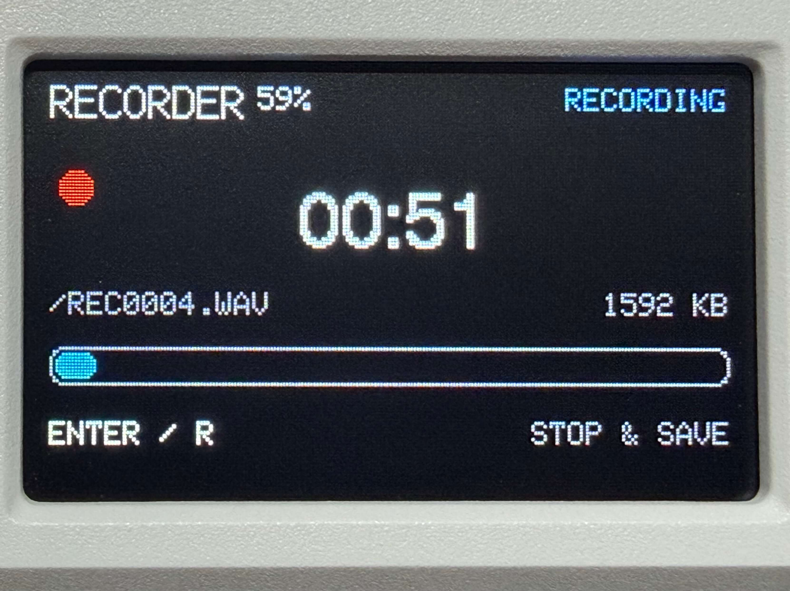
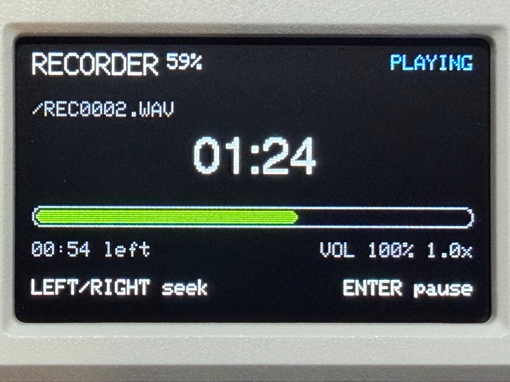
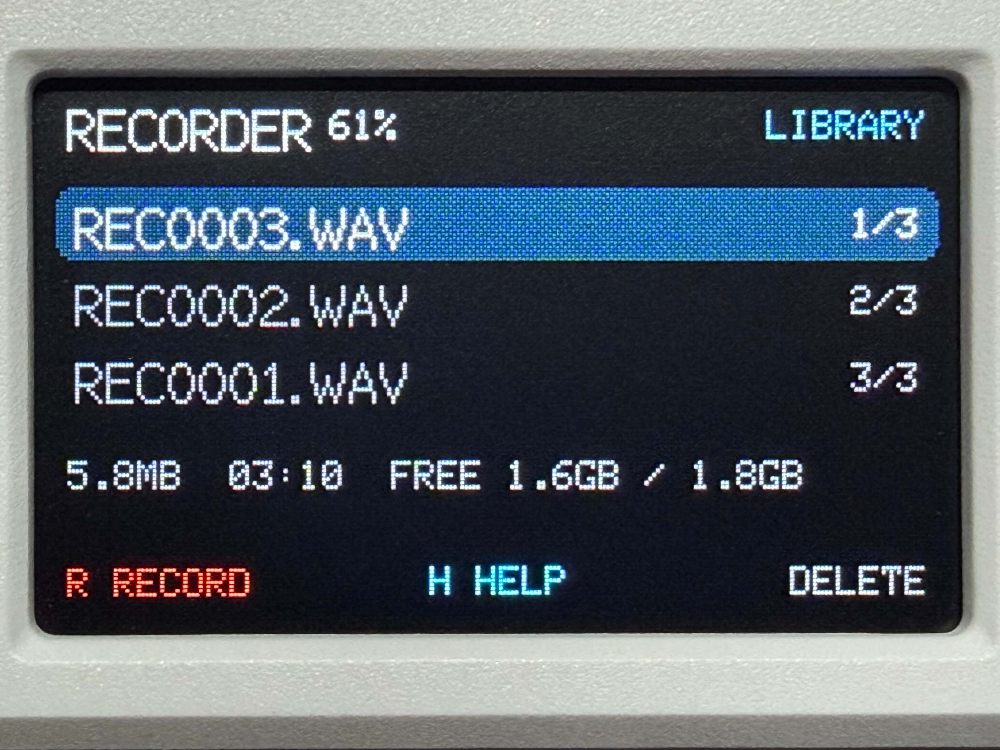
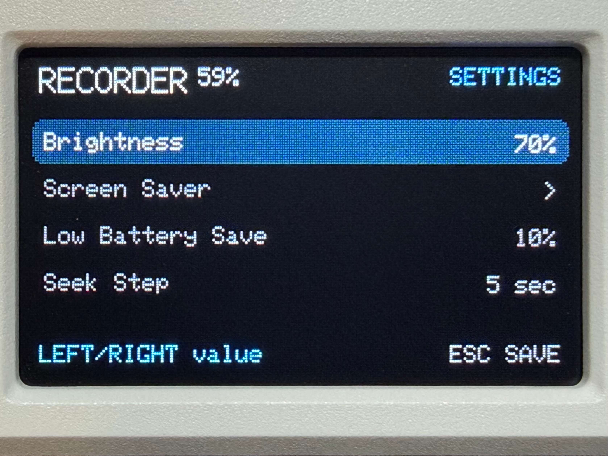
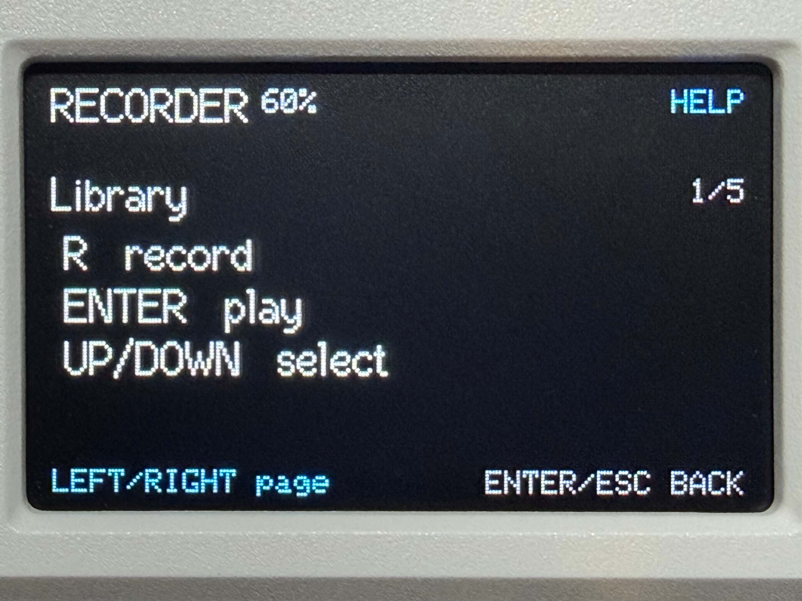
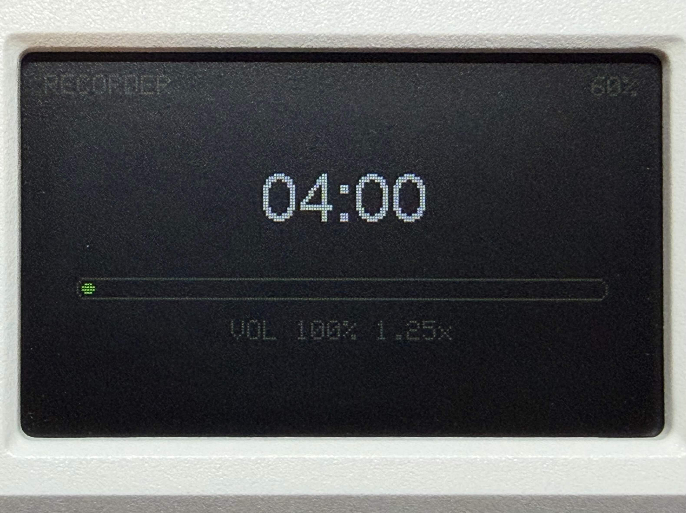

# Cardputer ADV Recorder

A voice recorder and WAV player for the M5Stack Cardputer ADV.

The firmware records 16 kHz, mono, 16-bit PCM WAV files directly to microSD.
Recording and playback are streamed through fixed-size buffers, so file length
is not limited by available RAM.

> Only Cardputer ADV is supported. The original Cardputer uses different audio
> hardware and is not compatible with this firmware.

## Screenshots

<p align="center">
  
  
  
</p>

<p align="center">
  
  
  
</p>

## Features

- Stream recordings to microSD as `/REC0001.WAV` through `/REC9999.WAV`.
- Browse, play, rename, lock, and delete WAV files from the device.
- Pause, seek, and adjust playback volume while listening.
- Show recording level, elapsed time, file size, battery status, SD free
  space, and selected-file details.
- Configure display brightness and screen saver behavior from the device.
- Keep recording or playback running while the screen is dimmed or off.
- Auto-save an active recording at the configured low battery threshold.
- Recover from missing cards, low space, and storage errors.
- Finalize WAV headers and sync storage before presenting a recording as saved.

## Requirements

- M5Stack Cardputer ADV
- Writable FAT32 microSD card
- PlatformIO Core 6.1.19 or PlatformIO IDE

## Build and upload

```sh
platformio run
platformio run --target upload
platformio device monitor
```

Release firmware is published as a complete image. Flash it at offset `0x0000`:

```sh
esptool.py --chip esp32s3 --baud 460800 write_flash \
  0x0000 cardputer-adv-recorder-vX.Y.Z.bin
```

The serial monitor runs at 115200 baud. To run host-side tests:

```sh
platformio test -e native-tests
```

## Project layout

- `src/app`: recorder state flow, UI, settings, screen saver, and file browser.
- `src/hardware`: Cardputer ADV board, audio, power, and microSD services.
- `src/media`: WAV parsing, writing, and recording filename helpers.

## Controls

| Key | Action |
| --- | --- |
| `R` | Start recording |
| `H` in library | Open help |
| `Enter`, `Esc`, or `R` | Stop and save a recording |
| Up/Down key positions (`;` / `.`) | Select a recording |
| `Enter` | Play the selected recording |
| `Enter` during playback | Pause or resume playback |
| `Esc` during playback | Stop playback |
| Left/Right during playback (`,` / `/`) | Seek backward or forward by the configured seek step |
| Up/Down during playback | Adjust volume |
| `[` / `]` during playback | Decrease or increase playback speed |
| Left in library (`,`) | Lock or unlock the selected recording |
| Right in library (`/`) | Rename the selected recording |
| `Delete` in library | Ask to delete the selected recording |
| `Enter` after `Delete` | Confirm deletion |
| Short `G0` press | Manually enter the configured screen saver mode |
| Long `G0` press | Open settings |
| Left/Right key positions (`,` / `/`) | Change a setting value |
| `Esc` in settings | Save settings or return from a submenu |
| `Enter` in rename | Save the new name |
| `Delete` in rename | Remove the last character |
| `Esc` in rename | Cancel rename |
| Left/Right in help | Change help page |
| `Enter` or `Esc` in help | Close help |

## Settings

Settings are saved on the device and restored after reboot. Brightness is
applied immediately. Screen saver options are grouped under `Screen Saver`:

| Setting | Values |
| --- | --- |
| Brightness | 10% through 100%, in 10% steps |
| Low Battery Save | Off, 1%, 5%, 10% |
| Seek Step | 5 sec, 10 sec, 20 sec, 60 sec |
| Reset to Default | Restores saved settings after confirmation |
| Version | Current firmware version |
| Screen Saver / When Home | Off, Dimmed Standby, Black |
| Screen Saver / While Recording | Off, Dimmed Standby, Black |
| Screen Saver / While Playing | Off, Dimmed Standby, Black |
| Screen Saver / Triple-Press Wake | Off, On |

`Low Battery Save` defaults to `10%`. When it is enabled and battery data is
valid, recording stops through the normal save path once the battery reaches
the selected threshold.

`Dimmed Standby` shows a low-brightness status screen. `Black` turns the
display off. Recording and playback continue in both modes; the first key
press wakes the screen and is not used as a stop, delete, or volume command.
When `Triple-Press Wake` is on, the same key must be pressed three times to
wake from `Dimmed Standby` or `Black`.

`Reset to Default` asks for confirmation before restoring brightness, screen
saver, triple-press wake, low battery save, and seek step to their defaults.

Playback speed starts at `1.0x` each time playback begins and can be changed
live from `0.75x` through `2.0x`. Speed changes adjust the playback sample
rate, so pitch changes with speed.

## File management

The library sorts recordings by filename descending so newer default names are
near the top. Locked recordings show `*` before the filename and cannot be
deleted until unlocked. Lock state is stored on the card in `RECORDER.LCK`;
if the file is missing or damaged, recordings remain usable.

Rename keeps the `.WAV` suffix automatically. Names are converted to uppercase
and accept letters, numbers, spaces, `_`, and `-`. Existing files are never
overwritten.

## Audio format

New recordings use 16 kHz mono 16-bit PCM. Playback accepts mono 16-bit PCM
WAV files and walks RIFF chunks instead of requiring audio to begin at byte 44.

See [audio and storage notes](docs/audio-and-storage.md),
[troubleshooting](docs/troubleshooting.md), and the
[hardware test checklist](docs/hardware-test-checklist.md).

## License

[MIT](LICENSE)
